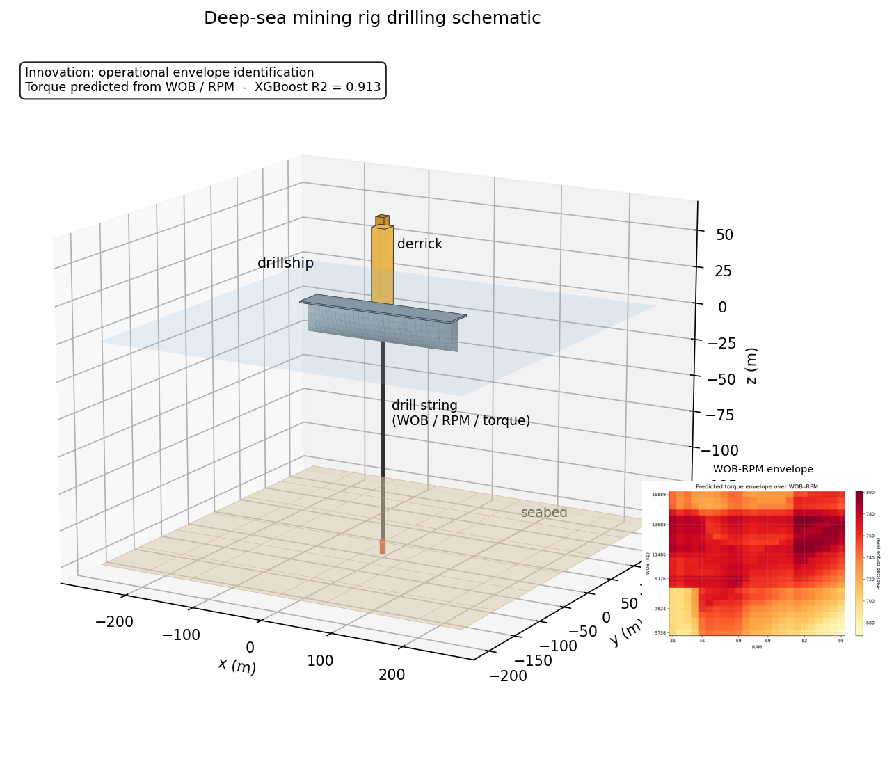
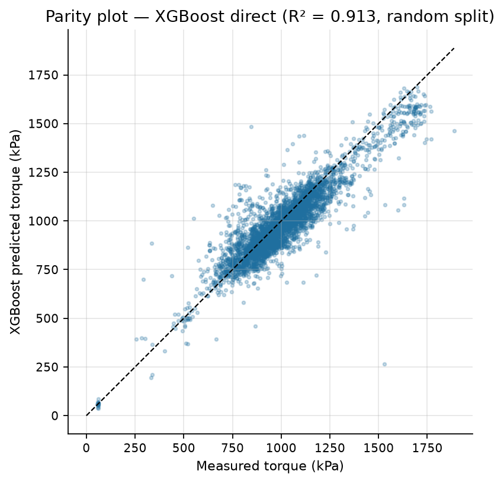
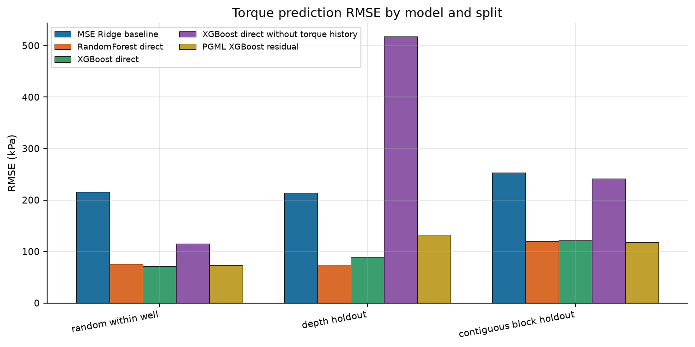
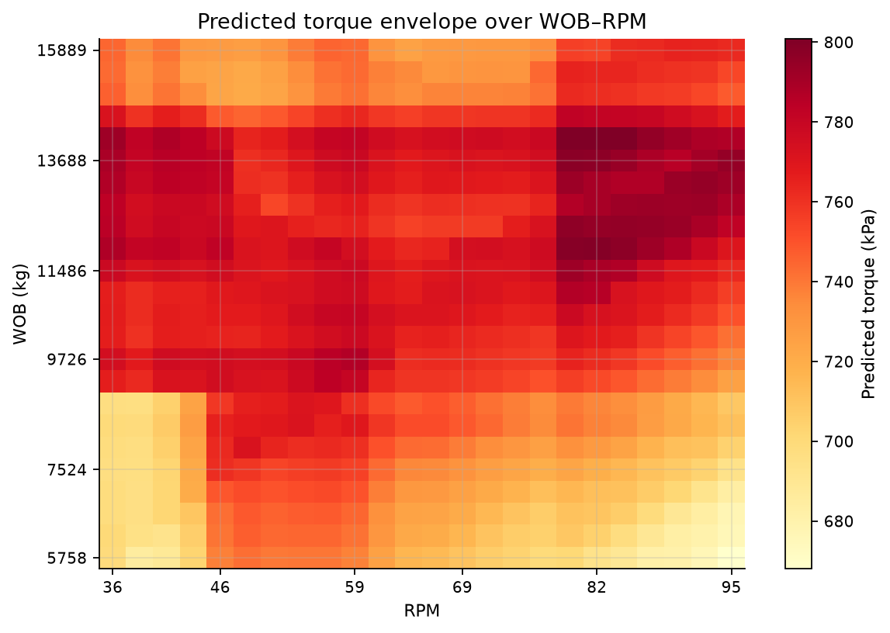
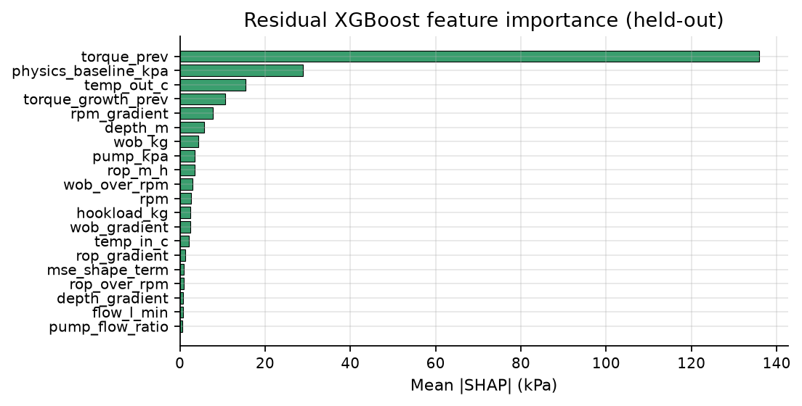

# 深海采矿钻机通道预测与运行包络

## 效果展示

  
  

研究论文题目：*Torque Prediction and Envelope Identification for Deepsea Mining Rigs*。

**成果状态**：2026-09-24 权威交接包包含五页修订终稿、最终 Word/PDF 和 Reviewer 1 八条回复，已有投稿及审稿修订记录。本项目不是新的未完成构思；本包尚未核实正式录用或会议论文集发表状态。

## 工程问题与研究路线

在监督层执行候选 WOB–RPM 指令前，估计当前工况下的通道响应，并用统计规则筛选候选指令。方法链为 MSE 形状特征＋岭回归机械基线＋XGBoost 残差；设置 Direct XGBoost、Random Forest、去历史特征消融，使用留出样本 SHAP。

Utah FORGE Well 58-32 是**地热钻进代理数据**；目标 `Surface Torque` 是 psi/kPa 压力通道，未标定为 N·m。记录按约 0.3 m 深度步处理；研究是当前深度处估计，不是已验证的时间提前预警。[官方数据说明](https://gdr.openei.org/submissions/1113)

样本链：**7,311 原始→6,586 筛选→6,584 因果滞后初始化后的建模样本**。

| 验证方式 / R² | RF | Direct XGBoost | Residual XGBoost |
| --- | ---: | ---: | ---: |
| 随机井内 80/20 | 0.901 | 0.913 | 0.908 |
| 最终深度 70/30 | 0.788 | 0.692 | 0.321 |
| 中间连续 20% 留出 | 0.765 | 0.759 | 0.774 |

保留不利结果：无历史特征的 Direct XGBoost 在最终深度区间 R² 为 **−9.427**。模型依赖近期通道持续性，随机划分的高分不能证明跨地层泛化。残差模型提供机械分解和可检查修正，但并非所有划分最优。

## 本包可实际核验的内容

在根目录运行 `python src/demo.py && python src/verify.py`：

1. 核验原 CSV 哈希与 7,311 行；三份划分各覆盖 6,584 行，逐样本预测与测试索引对应。
2. 从 4,610 条留出预测记录复算 **15 组模型×划分、60 个 R²/RMSE/MAE/MAPE 指标**。不同划分的记录可能重叠，不计为 4,610 个独立实验。
3. 对 **2,025** 个 WOB–RPM 候选点核验三条件规则，重现 **1,178 个（58.2%）**接受点。原表 `safe` 字段仅表示统计包络接受，不表示安全认证。

阈值：通道 < **1,212.126 kPa**；正向增量 < **67.29 kPa/约 0.3 m 步**；绝对残差 < **259.834 kPa**。它们是数据派生局部筛选规则，不是设备额定限制。

## 复现限制与来源

迁移备份找到了原始 CSV、预测、划分、包络网格和 SHAP 汇总。原最终训练脚本和模型二进制未在这些迁移目录中找到，因此本版是**预测回放和规则核验**，不声称重新训练复现、重新计算 SHAP 或重新生成包络预测。新 `envelope.py` 是根据原阈值构建的便携筛选实现。

原始数据作者 Robert Podgorney、John McLennan、Joe Moore；发布者 Idaho National Laboratory；2018；DOI [10.15121/1495411](https://doi.org/10.15121/1495411)，[CC BY 4.0](https://creativecommons.org/licenses/by/4.0/)。随附原始 CSV 未改动；预测、划分和包络是研究派生数据。详细署名与处理说明见 [DATA_ATTRIBUTION.md](DATA_ATTRIBUTION.md)。

原论文/审稿交接包另存于本地附件，没有自动把论文全文、邮件或版权注册表加入公开仓库。

## Figures

Regenerate with `python figures/make_figures.py` (needs `matplotlib`, `pandas`, `numpy`).

### 3D schematic illustration

Schematic illustration rendered in Python (matplotlib) - not ANSYS/Fluent/STAR-CCM+ output. Regenerate with `python figures/make_3d_schematic.py` (needs `matplotlib`, `numpy`). Drillship, derrick and drill string illustrate the system whose torque (WOB / RPM) this project models.
